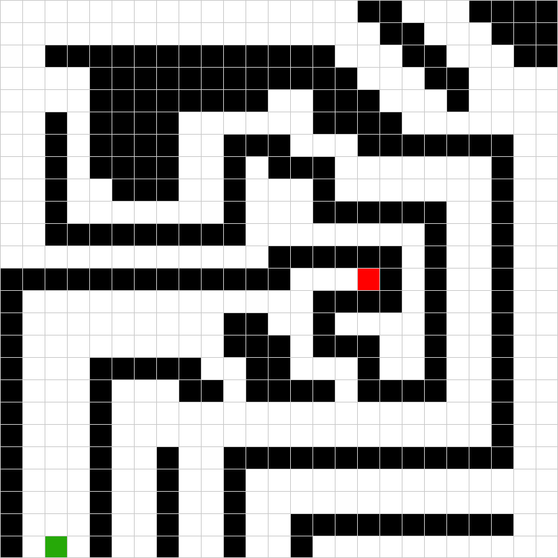

# Overview Runner_01

This package works with pcimr_simulation to accomplish the task of moving a robot from a fixed start to a fixed end position. This is achieved by listening to the robot position and robot sensors while moving north when possible and east until not possible anymore. If the robot hits both boundaries the finish position is reached. **This only works for this specific configuration.**

